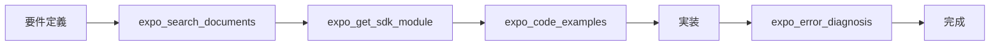
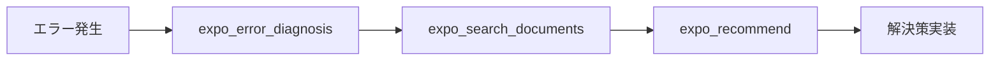
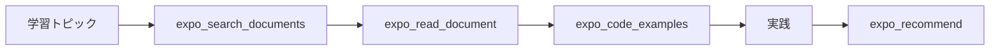

# MCP ツールリファレンス

## 概要

Expo MCP Serverが提供する全MCPツールの詳細ガイド。実際の使用例、ベストプラクティス、トラブルシューティングを含みます。

## ツール分類

### ドキュメント・情報取得
- [expo_read_document](#expo_read_document) - 個別ドキュメント取得
- [expo_search_documents](#expo_search_documents) - 検索
- [expo_recommend](#expo_recommend) - 推薦

### SDK・開発支援
- [expo_get_sdk_module](#expo_get_sdk_module) - SDK モジュール情報
- [expo_config_templates](#expo_config_templates) - 設定ファイル生成
- [expo_eas_command_builder](#expo_eas_command_builder) - EAS コマンド生成

### コード・デバッグ支援
- [expo_code_examples](#expo_code_examples) - コード例取得
- [expo_error_diagnosis](#expo_error_diagnosis) - エラー診断

---

# ドキュメント・情報取得ツール

## expo_read_document

### 概要
特定のExpoドキュメントページ、APIリファレンス、ガイドの詳細内容を取得します。

### 主な用途
- 最新APIドキュメントの確認
- ガイド記事の詳細参照
- チュートリアル内容の取得
- 特定機能の詳細調査

### パラメータ詳細

#### url (必須)
- **型**: string (URI形式)
- **説明**: 取得対象のドキュメントURL
- **対応URL**:
  - `https://docs.expo.dev/versions/latest/sdk/*`
  - `https://docs.expo.dev/guides/*`
  - `https://docs.expo.dev/tutorial/*`
  - `https://expo.github.io/vector-icons/`

#### doc_type (オプション)
- **型**: "guide" | "api" | "tutorial" | "reference"
- **説明**: ドキュメントタイプのヒント
- **効果**: パースとフォーマットの最適化

### 実用例

#### 基本的な使用

```javascript
// Claude/Cursor での使用例
"expo_read_document ツールを使って、expo-cameraの最新APIドキュメントを取得して"

// 対応するMCP呼び出し
{
  "name": "expo_read_document",
  "arguments": {
    "url": "https://docs.expo.dev/versions/latest/sdk/camera/",
    "doc_type": "api"
  }
}
```

#### 特定機能の詳細調査

```javascript
// プッシュ通知の設定方法を詳しく知りたい場合
{
  "name": "expo_read_document", 
  "arguments": {
    "url": "https://docs.expo.dev/push-notifications/overview/",
    "doc_type": "guide"
  }
}
```

#### チュートリアルの取得

```javascript
// 初心者向けチュートリアルの取得
{
  "name": "expo_read_document",
  "arguments": {
    "url": "https://docs.expo.dev/tutorial/create-your-first-app/",
    "doc_type": "tutorial"
  }
}
```

### レスポンス活用方法

取得したドキュメントは以下の形式で返されます：

```markdown
# Document: Camera API

## インストール
```bash
npx expo install expo-camera
```

## 使用方法
...

---
Source: https://docs.expo.dev/versions/latest/sdk/camera/
Type: api
Last Modified: 2024-12-01
```

### よくある質問

**Q: 古いSDKバージョンのドキュメントも取得できますか？**
A: はい。URLでバージョンを指定してください（例: `/versions/sdk-49/sdk/camera/`）

**Q: 外部ドキュメント（GitHub、NPM等）は対応していますか？**
A: 現在はExpo公式ドキュメントのみ対応。外部サイトは今後のアップデートで対応予定。

**Q: ドキュメントが見つからない場合は？**
A: 404エラーが返されます。URLの確認、または類似のドキュメントをsearchツールで探すことをお勧めします。

---

## expo_search_documents

### 概要
Expoエコシステム全体から関連コンテンツを検索します。あいまい検索、フィルタリング、関連度スコアリングに対応。

### 主な用途
- 特定機能の関連ドキュメント検索
- エラーメッセージからの解決策検索
- 実装パターンの発見
- 類似機能の比較調査

### パラメータ詳細

#### query (必須)
- **型**: string (1-500文字)
- **説明**: 検索キーワード・フレーズ
- **Tips**:
  - 具体的なキーワードを使用
  - スペース区切りで複数キーワード指定可
  - 日本語・英語両方対応

#### filters (オプション)
検索結果を絞り込むためのフィルタ群。

##### category
- **型**: Array<"docs" | "api" | "examples" | "tutorials">
- **説明**: 検索対象のコンテンツタイプ
- **例**: `["api", "docs"]` - APIドキュメントとガイドのみ

##### platform
- **型**: Array<"ios" | "android" | "web" | "universal">
- **説明**: 対象プラットフォーム
- **例**: `["ios", "android"]` - モバイルプラットフォームのみ

##### sdk_version
- **型**: Array<"latest" | "sdk-49" | "sdk-48">
- **説明**: SDK バージョン範囲
- **例**: `["latest"]` - 最新バージョンのみ

##### module_type
- **型**: Array<"core" | "community" | "deprecated">
- **説明**: モジュールタイプ
- **例**: `["core"]` - 公式モジュールのみ

### 実用例

#### 基本検索

```javascript
// カメラ関連の情報を幅広く検索
{
  "name": "expo_search_documents",
  "arguments": {
    "query": "camera photo capture"
  }
}
```

#### 絞り込み検索

```javascript
// iOSでのプッシュ通知APIのみを検索
{
  "name": "expo_search_documents",
  "arguments": {
    "query": "push notifications",
    "filters": {
      "category": ["api"],
      "platform": ["ios"],
      "module_type": ["core"]
    }
  }
}
```

#### 問題解決型検索

```javascript
// エラーメッセージから解決策を検索
{
  "name": "expo_search_documents",
  "arguments": {
    "query": "EACCES permission denied camera",
    "filters": {
      "category": ["docs", "tutorials"]
    }
  }
}
```

### 検索のコツ

#### 効果的なクエリ作成
1. **具体的な用語を使用**
   - ❌ "写真" → ✅ "camera photo capture"
   - ❌ "通知" → ✅ "push notification"

2. **機能名を含める**
   - ✅ "expo-camera takePictureAsync"
   - ✅ "MediaLibrary saveToLibraryAsync"

3. **エラーの場合は正確なメッセージを**
   - ✅ "Metro has encountered an error"
   - ✅ "Unable to resolve module"

#### フィルタ活用
- **初心者**: `category: ["tutorials", "docs"]`
- **上級者**: `category: ["api", "examples"]`
- **特定プラットフォーム**: `platform: ["ios"]` 或いは `["android"]`
- **安定版のみ**: `module_type: ["core"]`

### レスポンス解析

```javascript
// 典型的なレスポンス構造
{
  "content": [{
    "type": "text",
    "text": `# Search Results for "camera permissions"

Found 5 results:

1. **Camera API - Permissions**
   - URL: https://docs.expo.dev/versions/latest/sdk/camera/#permissions
   - Score: 0.95
   - Type: api
   - Summary: Camera permission handling for iOS and Android

2. **MediaLibrary Permissions** 
   - URL: https://docs.expo.dev/versions/latest/sdk/media-library/#permissions
   - Score: 0.87
   - Type: api
   - Summary: Managing photo library access permissions

...`
  }]
}
```

#### スコア解釈
- **0.9-1.0**: 非常に関連性が高い（ほぼ確実に求めている情報）
- **0.7-0.9**: 高い関連性（詳細確認推奨）
- **0.5-0.7**: 中程度の関連性（参考情報として有用）
- **0.3-0.5**: 低い関連性（関連する可能性がある情報）

---

## expo_recommend

### 概要
現在のコンテキスト（作業内容、コード、問題等）に基づいて、最適な関連コンテンツを推薦します。

### 主な用途
- 次にやるべき作業の提案
- 関連機能の発見
- ベストプラクティスの学習
- 実装方法の最適化提案

### パラメータ詳細

#### context (必須)
- **型**: string (1-1000文字)
- **説明**: 推薦の基となる状況・コンテキスト
- **含めるべき情報**:
  - 現在の作業内容
  - 使用している技術・ライブラリ
  - 抱えている問題
  - 実現したい機能

#### max_results (オプション)
- **型**: integer (1-10)
- **デフォルト**: 5
- **説明**: 最大推薦数

#### platform (オプション)
- **型**: "ios" | "android" | "web" | "universal"
- **説明**: 対象プラットフォーム指定

### 実用例

#### 機能拡張の推薦

```javascript
// 現在のアプリに追加できる機能を知りたい
{
  "name": "expo_recommend",
  "arguments": {
    "context": "写真撮影アプリを作成中。expo-cameraで写真撮影は実装済み。ユーザーエクスペリエンスを向上させたい。",
    "max_results": 5,
    "platform": "universal"
  }
}
```

#### 問題解決の推薦

```javascript
// 問題の解決策を求める
{
  "name": "expo_recommend", 
  "arguments": {
    "context": "expo-cameraで撮影した写真をユーザーのギャラリーに保存したいが、Androidで権限エラーが発生する。",
    "max_results": 3,
    "platform": "android"
  }
}
```

#### 学習パスの推薦

```javascript
// 次に学ぶべき内容の提案
{
  "name": "expo_recommend",
  "arguments": {
    "context": "Expo初心者。基本的なアプリは作れるようになった。NavigationとStateの管理を学びたい。",
    "max_results": 4
  }
}
```

### コンテキスト作成のベストプラクティス

#### 効果的なコンテキスト
1. **具体的かつ詳細**
   ```
   ❌ "アプリを作っている"
   ✅ "写真フィルターアプリを作成中。expo-cameraで撮影、expo-image-manipulatorでフィルター適用まで実装済み。"
   ```

2. **現在の技術スタックを明記**
   ```
   ✅ "React Navigation 6、expo-router、TypeScript、expo-secure-storeを使用"
   ```

3. **具体的な問題・目標を含める**
   ```
   ✅ "ユーザーが撮影した写真をクラウドにバックアップする機能を追加したい"
   ```

#### コンテキストの構成要素
- **現状**: 何ができているか
- **問題**: 何が困っているか
- **目標**: 何を実現したいか
- **制約**: 技術的・時間的制約
- **環境**: プラットフォーム、バージョン等

### 推薦結果の活用

推薦結果は関連度順に表示され、それぞれに推薦理由が付きます：

```markdown
1. **MediaLibrary.saveToLibraryAsync()**
   - Relevance: 0.98
   - Reason: 写真をデバイスのギャラリーに保存する主要メソッド
   - URL: https://docs.expo.dev/versions/latest/sdk/media-library/

2. **Permissions Guide**
   - Relevance: 0.94  
   - Reason: Android写真保存に必要な権限設定の詳細ガイド
   - URL: https://docs.expo.dev/guides/permissions/
```

#### 推薦理由の活用
- **高関連度 (0.9+)**: 即座に実装・学習を検討
- **中関連度 (0.7-0.9)**: 詳細を確認して適用判断
- **低関連度 (0.5-0.7)**: 将来的な参考として保存

---

# SDK・開発支援ツール

## expo_get_sdk_module

### 概要
Expo SDK モジュールの包括的な情報を取得します。API仕様、使用例、プラットフォーム互換性、インストール方法を提供。

### 主な用途
- 新しいSDKモジュールの調査
- APIメソッドの詳細確認
- プラットフォーム互換性チェック
- 非推奨API の確認
- インストール・設定手順の取得

### パラメータ詳細

#### module_name (必須)
- **型**: string (英数字、ハイフン、アンダースコア)
- **形式**: `expo-*` または `@expo/*`
- **例**: 
  - `expo-camera`
  - `expo-media-library` 
  - `expo-notifications`
  - `@expo/vector-icons`

#### sdk_version (オプション)
- **型**: "latest" | "sdk-49" | "sdk-48"
- **デフォルト**: "latest"
- **説明**: 取得するSDKバージョン

### 実用例

#### 基本的なモジュール情報取得

```javascript
// expo-cameraの最新情報を取得
{
  "name": "expo_get_sdk_module",
  "arguments": {
    "module_name": "expo-camera"
  }
}
```

#### 特定バージョンの情報取得

```javascript
// 旧バージョンとの互換性確認
{
  "name": "expo_get_sdk_module",
  "arguments": {
    "module_name": "expo-notifications",
    "sdk_version": "sdk-49"
  }
}
```

#### プラットフォーム固有モジュール調査

```javascript
// Web対応状況の確認
{
  "name": "expo_get_sdk_module",
  "arguments": {
    "module_name": "expo-haptics"
  }
}
```

### レスポンス構造解説

取得される情報の主要要素：

#### 1. 基本情報
```markdown
# SDK Module: expo-camera (SDK 50)

## Installation
```bash
npx expo install expo-camera
```

## Platform Compatibility
| Platform | Supported | Min Version | Limitations |
|----------|-----------|-------------|-------------|
| iOS | ✅ | 11.0 | None |
| Android | ✅ | API 21 | None |  
| Web | ❌ | N/A | Use browser APIs |
```

#### 2. APIメソッド詳細
```markdown
### Camera.takePictureAsync(options)

**Signature:** `takePictureAsync(options?: CameraPictureOptions): Promise<CameraCapturedPicture>`

**Description:** Captures a picture and returns information about the captured image

**Platforms:** ios, android

**Since:** SDK 1.0.0

⚠️ **DEPRECATED**: Since SDK 48 - Use `Camera.takePictureAsync2()` instead
```

#### 3. 使用例
```typescript
**TypeScript Example:**
```typescript
import { Camera } from 'expo-camera';

const takePicture = async () => {
  const photo = await cameraRef.current.takePictureAsync({
    quality: 1,
    base64: true
  });
  console.log(photo.uri);
};
```

### モジュール選択ガイド

#### カメラ機能
- **expo-camera**: 写真・動画撮影
- **expo-image-picker**: ギャラリーからの選択
- **expo-media-library**: ギャラリー操作

#### 通知機能  
- **expo-notifications**: プッシュ通知
- **expo-haptics**: 触覚フィードバック
- **expo-audio**: 音声通知

#### ストレージ
- **expo-secure-store**: セキュアストレージ
- **expo-file-system**: ファイル操作
- **expo-sqlite**: ローカルデータベース

### よくある活用パターン

#### マイグレーション支援
```javascript
// 古いAPIから新しいAPIへの移行情報取得
{
  "name": "expo_get_sdk_module",
  "arguments": {
    "module_name": "expo-permissions"  // 非推奨モジュール
  }
}
// → 新しい権限システムへの移行方法が提示される
```

#### プラットフォーム固有調査
```javascript
// Web対応の詳細確認
{
  "name": "expo_get_sdk_module", 
  "arguments": {
    "module_name": "expo-location"
  }
}
// → Web での制限事項、代替実装方法が提示される
```

---

## expo_config_templates

### 概要
Expoプロジェクトの設定ファイル（app.json、eas.json、metro.config.js）を、プロジェクトコンテキストに基づいて生成・最適化します。

### 主な用途
- 新規プロジェクトの設定ファイル作成
- 既存設定の最適化・検証
- プラットフォーム固有設定の追加
- ビルド設定の構成

### パラメータ詳細

#### template_type (必須)
生成する設定ファイルの種類：

- **app.json**: アプリケーション基本設定
- **eas.json**: EAS ビルド・デプロイ設定  
- **metro.config.js**: Metro バンドラー設定

#### project_context (オプション)
プロジェクトの詳細情報：

##### name
- **型**: string
- **説明**: アプリケーション名
- **影響**: Bundle identifier、display nameに反映

##### platforms
- **型**: Array<"ios" | "android" | "web">
- **説明**: 対象プラットフォーム
- **影響**: プラットフォーム固有設定の有無

##### sdk_version
- **型**: string
- **説明**: 使用するExpo SDK バージョン
- **影響**: 利用可能機能、設定オプション

### 実用例

#### 新規アプリのapp.json生成

```javascript
{
  "name": "expo_config_templates",
  "arguments": {
    "template_type": "app.json",
    "project_context": {
      "name": "MyPhotoApp",
      "platforms": ["ios", "android"],
      "sdk_version": "50.0.0"
    }
  }
}
```

生成例：
```json
{
  "expo": {
    "name": "MyPhotoApp", 
    "slug": "my-photo-app",
    "version": "1.0.0",
    "orientation": "portrait",
    "icon": "./assets/icon.png",
    "userInterfaceStyle": "light",
    "splash": {
      "image": "./assets/splash.png",
      "resizeMode": "contain",
      "backgroundColor": "#ffffff"
    },
    "ios": {
      "supportsTablet": true,
      "bundleIdentifier": "com.yourcompany.myphotoapp",
      "infoPlist": {
        "NSCameraUsageDescription": "This app uses camera to take photos."
      }
    },
    "android": {
      "adaptiveIcon": {
        "foregroundImage": "./assets/adaptive-icon.png",
        "backgroundColor": "#FFFFFF"
      },
      "package": "com.yourcompany.myphotoapp",
      "permissions": ["CAMERA", "WRITE_EXTERNAL_STORAGE"]
    },
    "web": {
      "favicon": "./assets/favicon.png"
    }
  }
}
```

#### EASビルド設定の生成

```javascript
{
  "name": "expo_config_templates",
  "arguments": {
    "template_type": "eas.json",
    "project_context": {
      "name": "ProductionApp",
      "platforms": ["ios", "android"]
    }
  }
}
```

生成例：
```json
{
  "cli": {
    "version": ">= 3.0.0"
  },
  "build": {
    "development": {
      "developmentClient": true,
      "distribution": "internal"
    },
    "preview": {
      "distribution": "internal",
      "ios": {
        "simulator": true
      }
    },
    "production": {
      "ios": {
        "resourceClass": "m1-medium"
      },
      "android": {
        "buildType": "apk"
      }
    }
  },
  "submit": {
    "production": {}
  }
}
```

#### Metro設定のカスタマイズ

```javascript
{
  "name": "expo_config_templates",
  "arguments": {
    "template_type": "metro.config.js",
    "project_context": {
      "platforms": ["ios", "android", "web"]
    }
  }
}
```

### 設定のベストプラクティス

#### app.json最適化
1. **パフォーマンス設定**
   - `userInterfaceStyle`: ダークモード対応
   - `orientation`: 必要な向きのみ指定
   - `splash.resizeMode`: 適切なサイズ調整

2. **セキュリティ設定**
   - 必要最小限の権限のみ要求
   - プロダクション用のBundle ID設定
   - 適切なinfo.plistエントリ

3. **プラットフォーム最適化**
   - iOS: Tablet対応、適切なInfo.plist
   - Android: Adaptive icon、適切な権限設定
   - Web: PWA対応、favicon設定

#### eas.json最適化
1. **ビルドプロファイル構成**
   - development: 開発用、developmentClient有効
   - preview: テスト用、内部配布
   - production: 本番用、最適化有効

2. **リソース最適化**
   - 適切なresourceClass選択
   - プラットフォーム固有設定

---

## expo_eas_command_builder

### 概要
EAS CLI コマンドを、操作内容とプロジェクトコンテキストに基づいて生成します。

### 主な用途
- ビルドコマンドの生成
- アプリストア提出コマンド作成
- OTAアップデートコマンド生成
- 認証情報管理コマンド作成

### パラメータ詳細

#### operation (必須)
実行したいEAS操作：

- **build**: アプリビルド
- **submit**: ストア提出
- **update**: OTAアップデート
- **credentials**: 認証情報管理

#### platform (必須)
- **型**: "ios" | "android" | "all"
- **説明**: 対象プラットフォーム

#### profile (オプション)
- **型**: string
- **デフォルト**: "development"
- **説明**: 使用するビルドプロファイル

### 実用例

#### 本番ビルドコマンド生成

```javascript
{
  "name": "expo_eas_command_builder",
  "arguments": {
    "operation": "build",
    "platform": "ios", 
    "profile": "production"
  }
}
```

生成結果：
```bash
# iOS Production Build
eas build --platform ios --profile production

# 追加オプション（推奨）
eas build --platform ios --profile production --clear-cache

# ローカルビルドの場合
eas build --platform ios --profile production --local
```

#### 全プラットフォーム同時ビルド

```javascript
{
  "name": "expo_eas_command_builder",
  "arguments": {
    "operation": "build",
    "platform": "all",
    "profile": "production"
  }
}
```

生成結果：
```bash
# All Platforms Production Build
eas build --platform all --profile production

# または個別実行（推奨）
eas build --platform ios --profile production
eas build --platform android --profile production
```

#### OTAアップデート配信

```javascript
{
  "name": "expo_eas_command_builder",
  "arguments": {
    "operation": "update",
    "platform": "all"
  }
}
```

生成結果：
```bash
# Over-the-Air Update
eas update --auto

# ブランチ指定更新
eas update --branch production --message "Bug fixes and performance improvements"

# プレビュー更新
eas update --branch preview --message "New feature preview"
```

### 操作別コマンドガイド

#### Build操作
```bash
# 開発ビルド
eas build --platform ios --profile development

# プレビュービルド（TestFlight/Internal Testing）
eas build --platform ios --profile preview

# 本番ビルド
eas build --platform ios --profile production --clear-cache
```

#### Submit操作
```bash
# App Store Connect提出
eas submit --platform ios --latest

# Google Play Console提出  
eas submit --platform android --latest

# 特定ビルドを提出
eas submit --platform ios --id [BUILD_ID]
```

#### Update操作
```bash
# 自動更新
eas update --auto

# ブランチ指定更新
eas update --branch production

# ロールバック
eas update --branch production --republish --group [GROUP_ID]
```

#### Credentials操作
```bash
# iOS証明書管理
eas credentials --platform ios

# Android キーストア管理
eas credentials --platform android

# 証明書削除
eas credentials --platform ios --clear-provisioning-profile
```

### コマンド最適化のTips

#### パフォーマンス向上
- `--clear-cache`: ビルドキャッシュクリア
- `--local`: ローカルビルド実行
- `--non-interactive`: CI/CD環境での自動実行

#### エラー対策
- `--verbose`: 詳細ログ出力
- `--no-wait`: ビルド完了を待機しない
- `--auto-submit`: ビルド完了後自動提出

---

# コード・デバッグ支援ツール

## expo_code_examples

### 概要
特定のパターン・機能に対応する実行可能なコード例を提供します。Snack統合により、ブラウザで即座に実行・編集が可能です。

### 主な用途
- 機能実装の参考コード取得
- 新しいAPIの使用方法学習
- デバッグ用の最小限コード作成
- プロトタイプ開発の出発点

### パラメータ詳細

#### pattern (必須)
- **型**: string (1-100文字)
- **説明**: 求めるコード例のパターン・機能
- **例**:
  - "camera photo capture"
  - "navigation drawer"
  - "async storage data"
  - "push notification handler"

#### language (オプション)
- **型**: "typescript" | "javascript"  
- **デフォルト**: "typescript"
- **説明**: コード例の言語

#### platform (オプション)
- **型**: "ios" | "android" | "web" | "universal"
- **説明**: 対象プラットフォーム

### 実用例

#### カメラ機能のコード例

```javascript
{
  "name": "expo_code_examples",
  "arguments": {
    "pattern": "camera photo capture with permissions",
    "language": "typescript",
    "platform": "universal"
  }
}
```

生成される例：
```typescript
import React, { useState, useRef } from 'react';
import { View, Text, TouchableOpacity, Image, Alert } from 'react-native';
import { Camera } from 'expo-camera';
import * as MediaLibrary from 'expo-media-library';

export default function CameraScreen() {
  const [hasCameraPermission, setHasCameraPermission] = useState<boolean | null>(null);
  const [hasMediaLibraryPermission, setHasMediaLibraryPermission] = useState<boolean | null>(null);
  const [photo, setPhoto] = useState<string | null>(null);
  const cameraRef = useRef<Camera>(null);

  React.useEffect(() => {
    (async () => {
      const cameraStatus = await Camera.requestCameraPermissionsAsync();
      setHasCameraPermission(cameraStatus.status === 'granted');
      
      const mediaLibraryStatus = await MediaLibrary.requestPermissionsAsync();
      setHasMediaLibraryPermission(mediaLibraryStatus.status === 'granted');
    })();
  }, []);

  const takePicture = async () => {
    if (cameraRef.current) {
      try {
        const photo = await cameraRef.current.takePictureAsync({
          quality: 1,
          base64: false,
        });
        setPhoto(photo.uri);
      } catch (error) {
        Alert.alert('Error', 'Failed to take picture');
      }
    }
  };

  const savePhoto = async () => {
    if (photo && hasMediaLibraryPermission) {
      try {
        await MediaLibrary.saveToLibraryAsync(photo);
        Alert.alert('Success', 'Photo saved to gallery');
      } catch (error) {
        Alert.alert('Error', 'Failed to save photo');
      }
    }
  };

  if (hasCameraPermission === null) {
    return <Text>Requesting camera permission...</Text>;
  }
  
  if (hasCameraPermission === false) {
    return <Text>No access to camera</Text>;
  }

  return (
    <View style={{ flex: 1 }}>
      {photo ? (
        <View style={{ flex: 1 }}>
          <Image source={{ uri: photo }} style={{ flex: 1 }} />
          <TouchableOpacity onPress={savePhoto}>
            <Text>Save Photo</Text>
          </TouchableOpacity>
          <TouchableOpacity onPress={() => setPhoto(null)}>
            <Text>Take Another</Text>
          </TouchableOpacity>
        </View>
      ) : (
        <Camera 
          style={{ flex: 1 }} 
          ref={cameraRef}
        >
          <View style={{ flex: 1, justifyContent: 'flex-end', alignItems: 'center' }}>
            <TouchableOpacity onPress={takePicture}>
              <Text style={{ fontSize: 18, color: 'white' }}>Take Photo</Text>
            </TouchableOpacity>
          </View>
        </Camera>
      )}
    </View>
  );
}
```

#### ナビゲーション実装例

```javascript
{
  "name": "expo_code_examples",
  "arguments": {
    "pattern": "react navigation stack navigator",
    "language": "typescript"
  }
}
```

#### 状態管理の例

```javascript
{
  "name": "expo_code_examples",
  "arguments": {
    "pattern": "context api state management",
    "language": "typescript"
  }
}
```

### パターン検索のコツ

#### 具体的なパターン指定
- ❌ "navigation" → ✅ "stack navigation with params"
- ❌ "storage" → ✅ "async storage user preferences"
- ❌ "api" → ✅ "fetch api with error handling"

#### 複合機能の指定
- ✅ "camera with permission and gallery save"
- ✅ "flatlist with pull to refresh"
- ✅ "form with validation and submission"

### コード例の活用方法

#### 1. Snack での実行
生成されたコード例は、多くの場合Snackリンクが含まれます：
```
🎯 Try this example in Snack: https://snack.expo.dev/@your-example
```

#### 2. プロジェクトへの統合
- 必要な依存関係を確認
- 権限設定を app.json に追加
- 型定義の調整

#### 3. カスタマイズ
- ビジネスロジックの追加
- UI/UXの調整
- エラーハンドリングの強化

---

## expo_error_diagnosis

### 概要
Expoアプリ開発で発生するエラーを分析し、具体的な解決策と予防策を提供します。

### 主な用途
- ビルドエラーの解決
- ランタイムエラーの診断
- Metro bundlerエラーの対処
- EAS関連エラーの解決
- 権限・設定エラーの修正

### パラメータ詳細

#### error_message (必須)
- **型**: string (1-2000文字)
- **説明**: 実際のエラーメッセージ
- **コツ**: スタックトレース全体をコピー推奨

#### error_type (オプション)
エラーの発生箇所：
- **build**: ビルド時エラー
- **runtime**: 実行時エラー
- **metro**: Metro bundlerエラー
- **eas**: EAS CLI/Buildエラー
- **expo_cli**: Expo CLIエラー

#### platform (オプション)
- **型**: "ios" | "android" | "web"
- **説明**: エラー発生プラットフォーム

### 実用例

#### ビルドエラーの診断

```javascript
{
  "name": "expo_error_diagnosis",
  "arguments": {
    "error_message": "Error: Could not find iPhone simulator. Please install Xcode and ensure it is properly configured.",
    "error_type": "build",
    "platform": "ios"
  }
}
```

診断結果例：
```markdown
# Error Diagnosis: iOS Simulator Not Found

## Problem Analysis
このエラーは、iOS シミュレーターが見つからないことを示しています。主な原因：
1. Xcode がインストールされていない
2. Xcode Command Line Tools が未設定
3. シミュレーターが起動していない

## Immediate Solutions

### 1. Xcode インストール確認
```bash
# Xcode バージョン確認
xcode-select --version

# Command Line Tools インストール
sudo xcode-select --install
```

### 2. シミュレーター起動
```bash
# 利用可能なシミュレーター一覧
xcrun simctl list devices

# シミュレーター起動
open -a Simulator
```

### 3. Expo設定確認
```bash
# iOS向けビルド
npx expo run:ios

# 特定のシミュレーター指定
npx expo run:ios --device "iPhone 14"
```

## Prevention
- Xcode定期アップデート
- Command Line Toolsバージョン確認
- 開発前のシミュレーター起動確認
```

#### 権限エラーの診断

```javascript
{
  "name": "expo_error_diagnosis",
  "arguments": {
    "error_message": "Error: Camera permissions not granted. User denied access to camera.",
    "error_type": "runtime",
    "platform": "ios"
  }
}
```

#### Metro bundlerエラーの診断

```javascript
{
  "name": "expo_error_diagnosis",
  "arguments": {
    "error_message": "Metro has encountered an error: Unable to resolve module `@react-navigation/native` from `App.js`",
    "error_type": "metro"
  }
}
```

### よくあるエラーパターン

#### 1. 依存関係エラー
**症状**: "Unable to resolve module"
**原因**: パッケージ未インストール、バージョン不整合
**解決**: 正しいインストールコマンド実行

#### 2. 権限エラー  
**症状**: "Permission denied"
**原因**: app.json設定不備、権限リクエスト未実装
**解決**: 適切な権限設定と実装

#### 3. ビルドエラー
**症状**: "Build failed"
**原因**: 設定ファイル問題、証明書エラー
**解決**: 設定見直し、キャッシュクリア

#### 4. プラットフォーム固有エラー
**症状**: 特定OSでのみ発生
**原因**: プラットフォーム固有API使用
**解決**: プラットフォーム判定、代替実装

### エラー予防のベストプラクティス

#### 開発環境
1. **依存関係管理**
   - package-lock.jsonのコミット
   - 定期的なnpm audit実行
   - セキュリティアップデート適用

2. **設定ファイル**
   - app.jsonの適切な権限設定
   - プラットフォーム固有設定の確認
   - ビルド設定の検証

3. **エラーハンドリング**
   - try-catch ブロックの適切な使用
   - ユーザーフレンドリーなエラーメッセージ
   - ログの適切な出力

---

# 統合活用例

## 開発ワークフローでの活用

### 1. 新機能実装フロー



### 2. 問題解決フロー



### 3. 学習フロー



## 効率的な使い方のコツ

### ツール組み合わせ
1. **調査 → 実装**
   - `expo_search_documents` で概要把握
   - `expo_get_sdk_module` で詳細確認
   - `expo_code_examples` で実装参考

2. **設定 → ビルド**
   - `expo_config_templates` で設定生成
   - `expo_eas_command_builder` でビルド実行

3. **エラー → 解決**
   - `expo_error_diagnosis` で原因分析
   - `expo_recommend` で関連情報取得

### 質問の仕方
- **具体的**: "カメラ" ではなく "expo-camera takePictureAsync"
- **コンテキスト含む**: 現在の状況、使用技術を明記
- **目的明確**: 何を実現したいかを明確に

---

*最終更新: 2024年12月* 